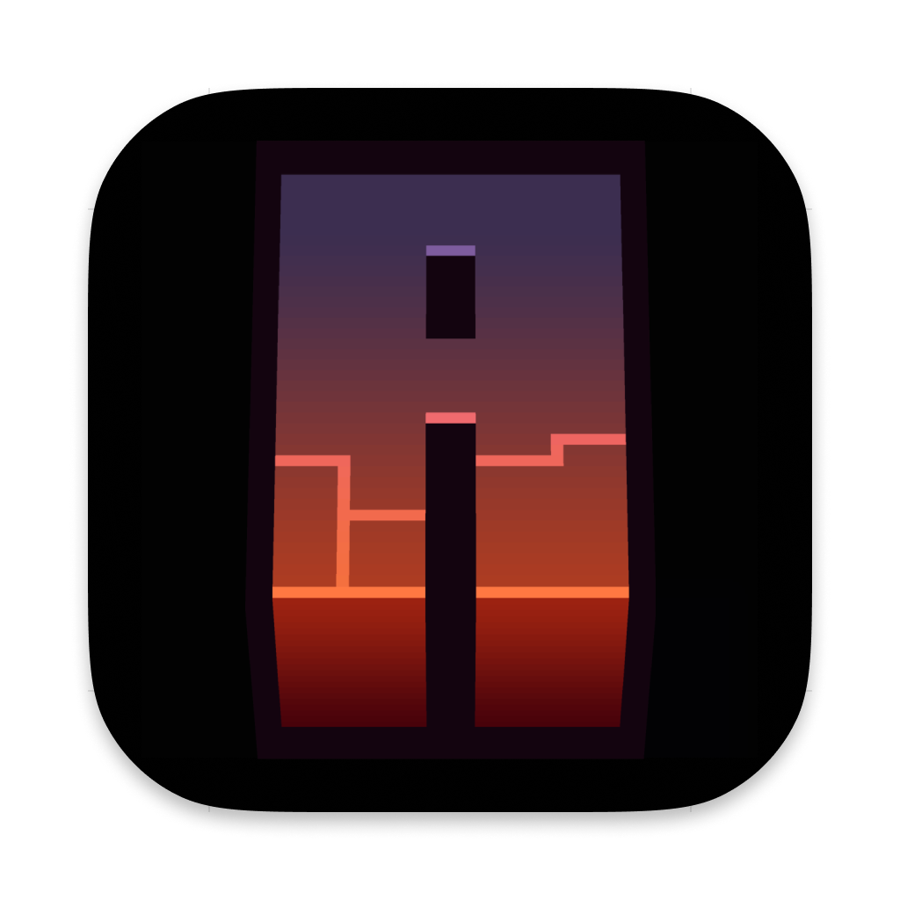
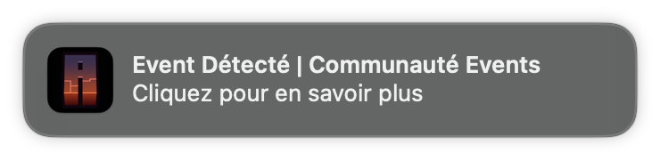

<div align="center">
    
</div>

---

# AutoEvent

AutoEvent is a lightweight and blazing fast event launcher built with [Neutralino](https://neutralino.js.org) and [Svelte](https://svelte.dev). It is currently in construction.

## Features

AutoEvent can notify you of upcoming events, while consumming close to no ram while running in the background. Clicking the alert will directly take you the the launch steps.

<figure>
  
  <figcaption>Image of what the notifications look like</figcaption>
</figure>

## Roadmap

Currently, a lot of features aren't present on certain platforms (ex: notifications and app focus don't work on linux and windows). This is due to the fact that the main dev (OrigamingWasTaken) is on MacOS, and can't develop for other OSes. So you are very welcome to help us implement the missing features!

### Curated list of need-to-implement features

**Mac**
- [x] Notifications
- [x] Alerts
- [x] Window functions
- [x] Autostarting
- [x] URL Scheme

**Windows**
- [ ] Notifications
- [ ] Alerts
- [ ] Window functions
- [ ] Autostarting
- [ ] URL Scheme

**Linux**
- [ ] Notifications
- [ ] Alerts
- [ ] Window functions
- [ ] Autostarting
- [ ] URL Scheme

## Nightly Builds

You can download the app from the [nightly builds](https://nightly.link/Communaute-Events/AutoEvent/workflows/build/main?preview)

## Building

(Note: If you're on Windows, you must install WSL)

Install Jq
```shell
# On macOS:
brew install jq
# On Linux or Windows/WSL:
sudo apt-get install jq
```

Clone the repo
```shell
git clone https://github.com/Communaute-Events/AutoEvent.git
```

Install the neu-cli
```shell
npm install -g @neutralinojs/neu
```

Run the build script for your target OS
```shell
# MacOS
./build mac
# Linux
./build linux
# Windows
./build win
# All platforms
./build all
```